# Flowchart Per Class ProgramGeometriElips2

Dokumen ini berisi flowchart per class sesuai alur source Java pada folder `src`.

Keterangan simbol:
- Oval: awal atau akhir proses.
- Persegi panjang: proses/perhitungan.
- Belah ketupat: keputusan/validasi.
- Panah bertuliskan `Ya` atau `Tidak`: cabang keputusan.

## 1. BendaGeometri

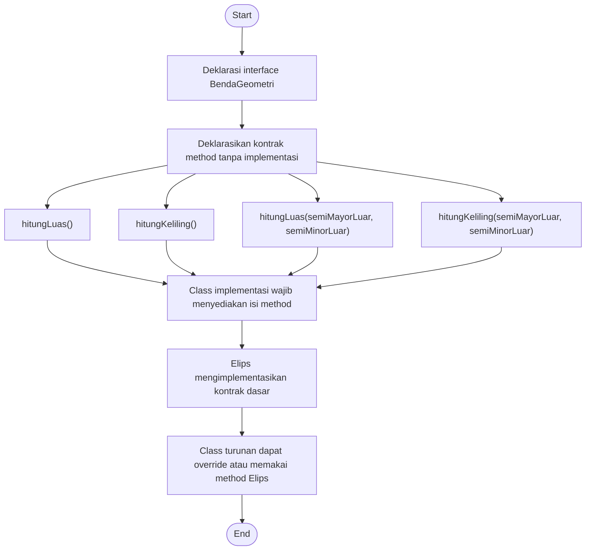
```mermaid
flowchart TD
    A([Start]) --> B["Deklarasi interface BendaGeometri"]
    B --> C["Deklarasikan kontrak method tanpa implementasi"]
    C --> D["hitungLuas()"]
    C --> E["hitungKeliling()"]
    C --> F["hitungLuas(semiMayorLuar, semiMinorLuar)"]
    C --> G["hitungKeliling(semiMayorLuar, semiMinorLuar)"]
    D --> H["Class implementasi wajib menyediakan isi method"]
    E --> H
    F --> H
    G --> H
    H --> I["Elips mengimplementasikan kontrak dasar"]
    I --> J["Class turunan dapat override atau memakai method Elips"]
    J --> K([End])
```

## 2. Elips

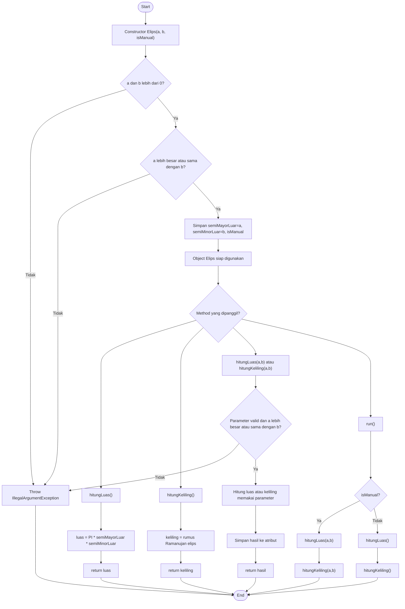
```mermaid
flowchart TD
    A([Start]) --> B["Constructor Elips(a, b, isManual)"]
    B --> C{"a dan b lebih dari 0?"}
    C -- Tidak --> X["Throw IllegalArgumentException"]
    C -- Ya --> D{"a lebih besar atau sama dengan b?"}
    D -- Tidak --> X
    D -- Ya --> E["Simpan semiMayorLuar=a, semiMinorLuar=b, isManual"]
    E --> F["Object Elips siap digunakan"]

    F --> G{"Method yang dipanggil?"}
    G --> H["hitungLuas()"]
    H --> H1["luas = PI * semiMayorLuar * semiMinorLuar"]
    H1 --> H2["return luas"]

    G --> I["hitungKeliling()"]
    I --> I1["keliling = rumus Ramanujan elips"]
    I1 --> I2["return keliling"]

    G --> J["hitungLuas(a,b) atau hitungKeliling(a,b)"]
    J --> J1{"Parameter valid dan a lebih besar atau sama dengan b?"}
    J1 -- Tidak --> X
    J1 -- Ya --> J2["Hitung luas atau keliling memakai parameter"]
    J2 --> J3["Simpan hasil ke atribut"]
    J3 --> J4["return hasil"]

    G --> K["run()"]
    K --> L{"isManual?"}
    L -- Ya --> M["hitungLuas(a,b)"]
    M --> N["hitungKeliling(a,b)"]
    L -- Tidak --> O["hitungLuas()"]
    O --> P["hitungKeliling()"]
    N --> Q([End])
    P --> Q
    H2 --> Q
    I2 --> Q
    J4 --> Q
    X --> Q
```

## 3. BolaElips

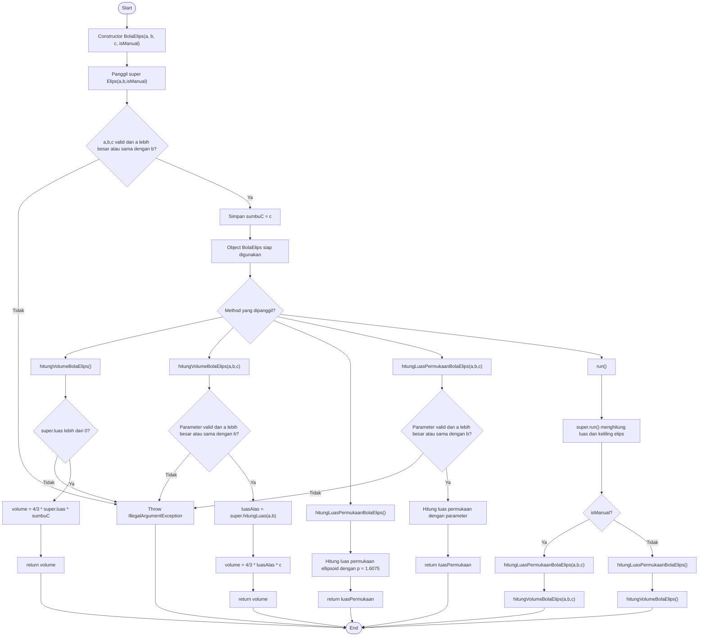
```mermaid
flowchart TD
    A([Start]) --> B["Constructor BolaElips(a, b, c, isManual)"]
    B --> C["Panggil super Elips(a,b,isManual)"]
    C --> D{"a,b,c valid dan a lebih besar atau sama dengan b?"}
    D -- Tidak --> X["Throw IllegalArgumentException"]
    D -- Ya --> E["Simpan sumbuC = c"]
    E --> F["Object BolaElips siap digunakan"]

    F --> G{"Method yang dipanggil?"}
    G --> H["hitungVolumeBolaElips()"]
    H --> H1{"super.luas lebih dari 0?"}
    H1 -- Tidak --> X
    H1 -- Ya --> H2["volume = 4/3 * super.luas * sumbuC"]
    H2 --> H3["return volume"]

    G --> I["hitungVolumeBolaElips(a,b,c)"]
    I --> I1{"Parameter valid dan a lebih besar atau sama dengan b?"}
    I1 -- Tidak --> X
    I1 -- Ya --> I2["luasAlas = super.hitungLuas(a,b)"]
    I2 --> I3["volume = 4/3 * luasAlas * c"]
    I3 --> I4["return volume"]

    G --> J["hitungLuasPermukaanBolaElips()"]
    J --> J1["Hitung luas permukaan ellipsoid dengan p = 1.6075"]
    J1 --> J2["return luasPermukaan"]

    G --> K["hitungLuasPermukaanBolaElips(a,b,c)"]
    K --> K1{"Parameter valid dan a lebih besar atau sama dengan b?"}
    K1 -- Tidak --> X
    K1 -- Ya --> K2["Hitung luas permukaan dengan parameter"]
    K2 --> K3["return luasPermukaan"]

    G --> L["run()"]
    L --> M["super.run() menghitung luas dan keliling elips"]
    M --> N{"isManual?"}
    N -- Ya --> O["hitungLuasPermukaanBolaElips(a,b,c)"]
    O --> P["hitungVolumeBolaElips(a,b,c)"]
    N -- Tidak --> Q["hitungLuasPermukaanBolaElips()"]
    Q --> R["hitungVolumeBolaElips()"]
    H3 --> S([End])
    I4 --> S
    J2 --> S
    K3 --> S
    P --> S
    R --> S
    X --> S
```

## 4. CincinElips

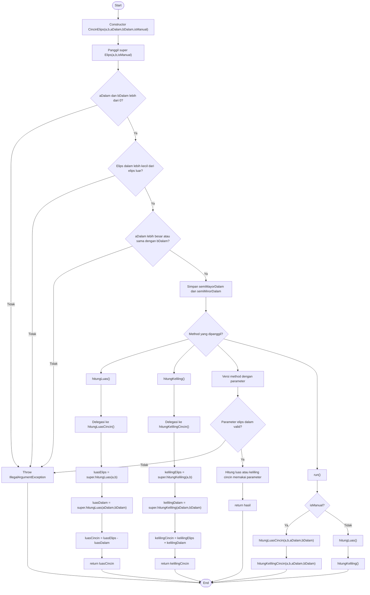
```mermaid
flowchart TD
    A([Start]) --> B["Constructor CincinElips(a,b,aDalam,bDalam,isManual)"]
    B --> C["Panggil super Elips(a,b,isManual)"]
    C --> D{"aDalam dan bDalam lebih dari 0?"}
    D -- Tidak --> X["Throw IllegalArgumentException"]
    D -- Ya --> E{"Elips dalam lebih kecil dari elips luar?"}
    E -- Tidak --> X
    E -- Ya --> F{"aDalam lebih besar atau sama dengan bDalam?"}
    F -- Tidak --> X
    F -- Ya --> G["Simpan semiMayorDalam dan semiMinorDalam"]

    G --> H{"Method yang dipanggil?"}
    H --> I["hitungLuas()"]
    I --> J["Delegasi ke hitungLuasCincin()"]
    J --> J1["luasElips = super.hitungLuas(a,b)"]
    J1 --> J2["luasDalam = super.hitungLuas(aDalam,bDalam)"]
    J2 --> J3["luasCincin = luasElips - luasDalam"]
    J3 --> J4["return luasCincin"]

    H --> K["hitungKeliling()"]
    K --> L["Delegasi ke hitungKelilingCincin()"]
    L --> L1["kelilingElips = super.hitungKeliling(a,b)"]
    L1 --> L2["kelilingDalam = super.hitungKeliling(aDalam,bDalam)"]
    L2 --> L3["kelilingCincin = kelilingElips + kelilingDalam"]
    L3 --> L4["return kelilingCincin"]

    H --> M["Versi method dengan parameter"]
    M --> M1{"Parameter elips dalam valid?"}
    M1 -- Tidak --> X
    M1 -- Ya --> M2["Hitung luas atau keliling cincin memakai parameter"]
    M2 --> M3["return hasil"]

    H --> N["run()"]
    N --> O{"isManual?"}
    O -- Ya --> P["hitungLuasCincin(a,b,aDalam,bDalam)"]
    P --> Q["hitungKelilingCincin(a,b,aDalam,bDalam)"]
    O -- Tidak --> R["hitungLuas()"]
    R --> T["hitungKeliling()"]
    J4 --> U([End])
    L4 --> U
    M3 --> U
    Q --> U
    T --> U
    X --> U
```

## 5. CincinElips3D

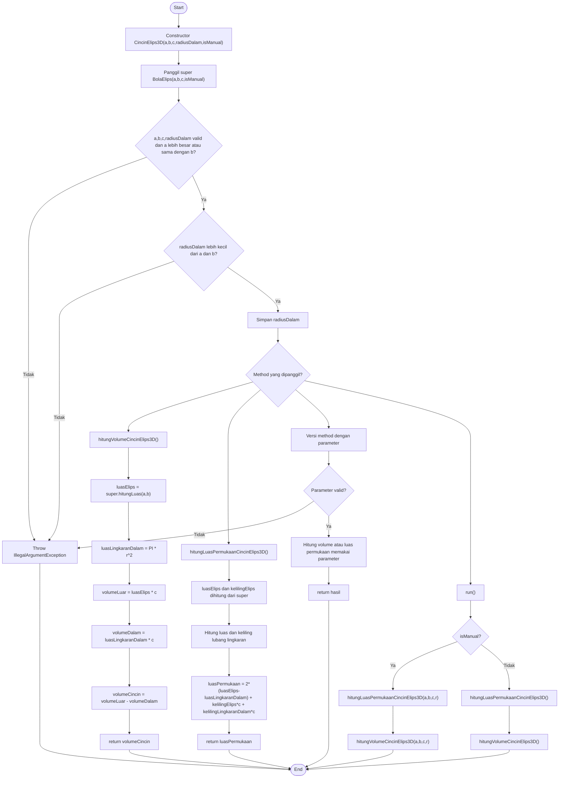
```mermaid
flowchart TD
    A([Start]) --> B["Constructor CincinElips3D(a,b,c,radiusDalam,isManual)"]
    B --> C["Panggil super BolaElips(a,b,c,isManual)"]
    C --> D{"a,b,c,radiusDalam valid dan a lebih besar atau sama dengan b?"}
    D -- Tidak --> X["Throw IllegalArgumentException"]
    D -- Ya --> E{"radiusDalam lebih kecil dari a dan b?"}
    E -- Tidak --> X
    E -- Ya --> F["Simpan radiusDalam"]

    F --> G{"Method yang dipanggil?"}
    G --> H["hitungVolumeCincinElips3D()"]
    H --> H1["luasElips = super.hitungLuas(a,b)"]
    H1 --> H2["luasLingkaranDalam = PI * r^2"]
    H2 --> H3["volumeLuar = luasElips * c"]
    H3 --> H4["volumeDalam = luasLingkaranDalam * c"]
    H4 --> H5["volumeCincin = volumeLuar - volumeDalam"]
    H5 --> H6["return volumeCincin"]

    G --> I["hitungLuasPermukaanCincinElips3D()"]
    I --> I1["luasElips dan kelilingElips dihitung dari super"]
    I1 --> I2["Hitung luas dan keliling lubang lingkaran"]
    I2 --> I3["luasPermukaan = 2*(luasElips-luasLingkaranDalam) + kelilingElips*c + kelilingLingkaranDalam*c"]
    I3 --> I4["return luasPermukaan"]

    G --> J["Versi method dengan parameter"]
    J --> J1{"Parameter valid?"}
    J1 -- Tidak --> X
    J1 -- Ya --> J2["Hitung volume atau luas permukaan memakai parameter"]
    J2 --> J3["return hasil"]

    G --> K["run()"]
    K --> L{"isManual?"}
    L -- Ya --> M["hitungLuasPermukaanCincinElips3D(a,b,c,r)"]
    M --> N["hitungVolumeCincinElips3D(a,b,c,r)"]
    L -- Tidak --> O["hitungLuasPermukaanCincinElips3D()"]
    O --> P["hitungVolumeCincinElips3D()"]
    H6 --> Q([End])
    I4 --> Q
    J3 --> Q
    N --> Q
    P --> Q
    X --> Q
```

## 6. JuringElips

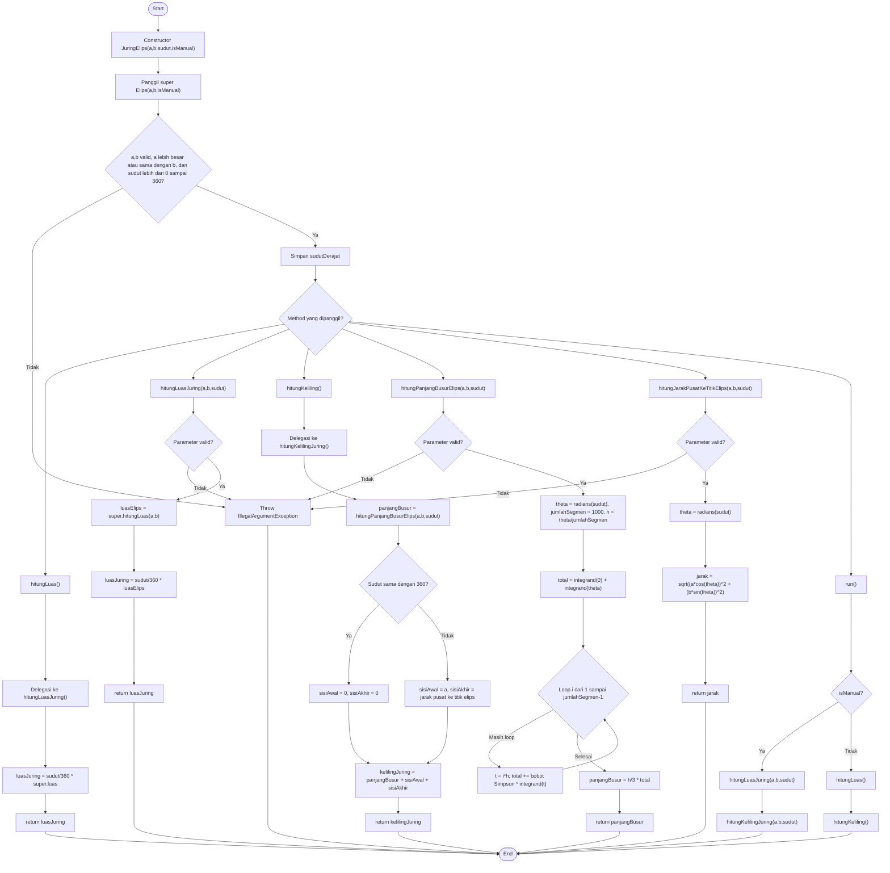
```mermaid
flowchart TD
    A([Start]) --> B["Constructor JuringElips(a,b,sudut,isManual)"]
    B --> C["Panggil super Elips(a,b,isManual)"]
    C --> D{"a,b valid, a lebih besar atau sama dengan b, dan sudut lebih dari 0 sampai 360?"}
    D -- Tidak --> X["Throw IllegalArgumentException"]
    D -- Ya --> E["Simpan sudutDerajat"]

    E --> F{"Method yang dipanggil?"}
    F --> G["hitungLuas()"]
    G --> H["Delegasi ke hitungLuasJuring()"]
    H --> H1["luasJuring = sudut/360 * super.luas"]
    H1 --> H2["return luasJuring"]

    F --> I["hitungLuasJuring(a,b,sudut)"]
    I --> I1{"Parameter valid?"}
    I1 -- Tidak --> X
    I1 -- Ya --> I2["luasElips = super.hitungLuas(a,b)"]
    I2 --> I3["luasJuring = sudut/360 * luasElips"]
    I3 --> I4["return luasJuring"]

    F --> J["hitungKeliling()"]
    J --> K["Delegasi ke hitungKelilingJuring()"]
    K --> K1["panjangBusur = hitungPanjangBusurElips(a,b,sudut)"]
    K1 --> K2{"Sudut sama dengan 360?"}
    K2 -- Ya --> K3["sisiAwal = 0, sisiAkhir = 0"]
    K2 -- Tidak --> K4["sisiAwal = a, sisiAkhir = jarak pusat ke titik elips"]
    K3 --> K5["kelilingJuring = panjangBusur + sisiAwal + sisiAkhir"]
    K4 --> K5
    K5 --> K6["return kelilingJuring"]

    F --> L["hitungPanjangBusurElips(a,b,sudut)"]
    L --> L1{"Parameter valid?"}
    L1 -- Tidak --> X
    L1 -- Ya --> L2["theta = radians(sudut), jumlahSegmen = 1000, h = theta/jumlahSegmen"]
    L2 --> L3["total = integrand(0) + integrand(theta)"]
    L3 --> L4{"Loop i dari 1 sampai jumlahSegmen-1"}
    L4 -- Masih loop --> L5["t = i*h; total += bobot Simpson * integrand(t)"]
    L5 --> L4
    L4 -- Selesai --> L6["panjangBusur = h/3 * total"]
    L6 --> L7["return panjangBusur"]

    F --> M["hitungJarakPusatKeTitikElips(a,b,sudut)"]
    M --> M1{"Parameter valid?"}
    M1 -- Tidak --> X
    M1 -- Ya --> M2["theta = radians(sudut)"]
    M2 --> M3["jarak = sqrt((a*cos(theta))^2 + (b*sin(theta))^2)"]
    M3 --> M4["return jarak"]

    F --> N["run()"]
    N --> O{"isManual?"}
    O -- Ya --> P["hitungLuasJuring(a,b,sudut)"]
    P --> Q["hitungKelilingJuring(a,b,sudut)"]
    O -- Tidak --> R["hitungLuas()"]
    R --> S["hitungKeliling()"]
    H2 --> T([End])
    I4 --> T
    K6 --> T
    L7 --> T
    M4 --> T
    Q --> T
    S --> T
    X --> T
```

## 7. JuringElips3D

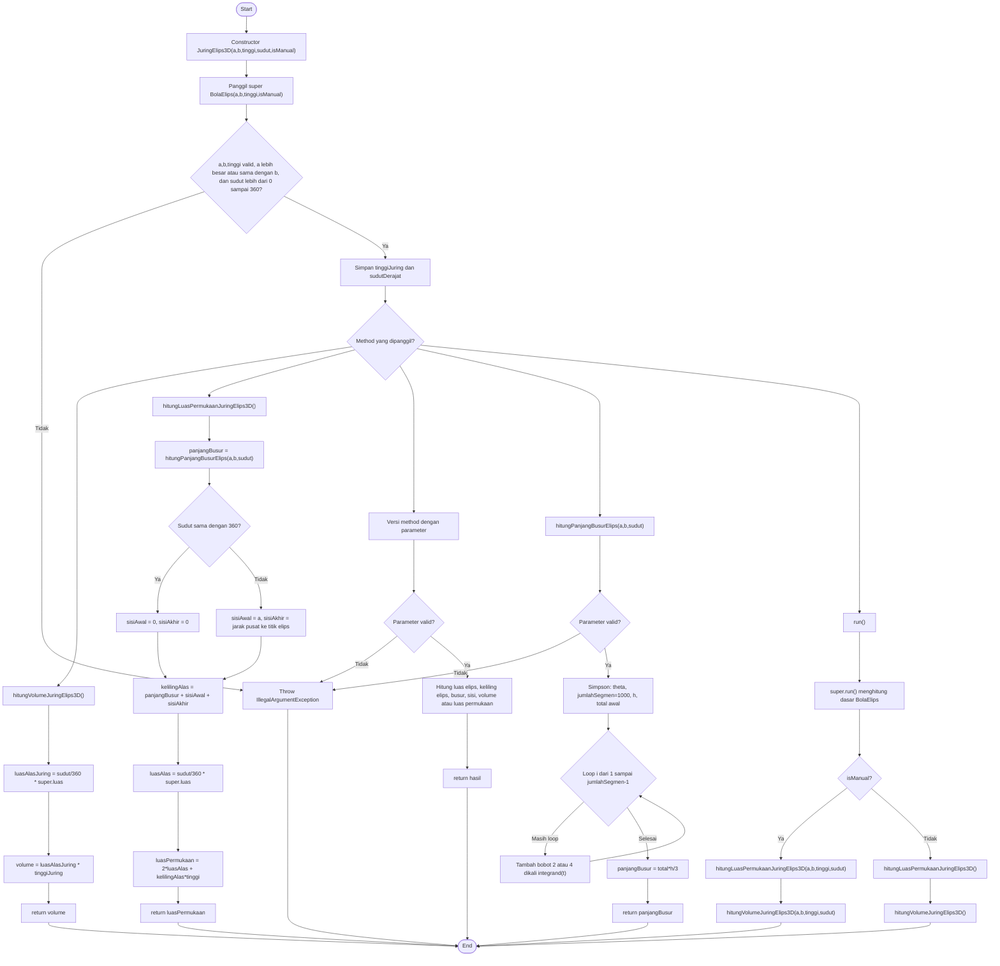
```mermaid
flowchart TD
    A([Start]) --> B["Constructor JuringElips3D(a,b,tinggi,sudut,isManual)"]
    B --> C["Panggil super BolaElips(a,b,tinggi,isManual)"]
    C --> D{"a,b,tinggi valid, a lebih besar atau sama dengan b, dan sudut lebih dari 0 sampai 360?"}
    D -- Tidak --> X["Throw IllegalArgumentException"]
    D -- Ya --> E["Simpan tinggiJuring dan sudutDerajat"]

    E --> F{"Method yang dipanggil?"}
    F --> G["hitungVolumeJuringElips3D()"]
    G --> G1["luasAlasJuring = sudut/360 * super.luas"]
    G1 --> G2["volume = luasAlasJuring * tinggiJuring"]
    G2 --> G3["return volume"]

    F --> H["hitungLuasPermukaanJuringElips3D()"]
    H --> H1["panjangBusur = hitungPanjangBusurElips(a,b,sudut)"]
    H1 --> H2{"Sudut sama dengan 360?"}
    H2 -- Ya --> H3["sisiAwal = 0, sisiAkhir = 0"]
    H2 -- Tidak --> H4["sisiAwal = a, sisiAkhir = jarak pusat ke titik elips"]
    H3 --> H5["kelilingAlas = panjangBusur + sisiAwal + sisiAkhir"]
    H4 --> H5
    H5 --> H6["luasAlas = sudut/360 * super.luas"]
    H6 --> H7["luasPermukaan = 2*luasAlas + kelilingAlas*tinggi"]
    H7 --> H8["return luasPermukaan"]

    F --> I["Versi method dengan parameter"]
    I --> I1{"Parameter valid?"}
    I1 -- Tidak --> X
    I1 -- Ya --> I2["Hitung luas elips, keliling elips, busur, sisi, volume atau luas permukaan"]
    I2 --> I3["return hasil"]

    F --> J["hitungPanjangBusurElips(a,b,sudut)"]
    J --> J1{"Parameter valid?"}
    J1 -- Tidak --> X
    J1 -- Ya --> J2["Simpson: theta, jumlahSegmen=1000, h, total awal"]
    J2 --> J3{"Loop i dari 1 sampai jumlahSegmen-1"}
    J3 -- Masih loop --> J4["Tambah bobot 2 atau 4 dikali integrand(t)"]
    J4 --> J3
    J3 -- Selesai --> J5["panjangBusur = total*h/3"]
    J5 --> J6["return panjangBusur"]

    F --> K["run()"]
    K --> L["super.run() menghitung dasar BolaElips"]
    L --> M{"isManual?"}
    M -- Ya --> N["hitungLuasPermukaanJuringElips3D(a,b,tinggi,sudut)"]
    N --> O["hitungVolumeJuringElips3D(a,b,tinggi,sudut)"]
    M -- Tidak --> P["hitungLuasPermukaanJuringElips3D()"]
    P --> Q["hitungVolumeJuringElips3D()"]
    G3 --> R([End])
    H8 --> R
    I3 --> R
    J6 --> R
    O --> R
    Q --> R
    X --> R
```

## 8. TemberengElips

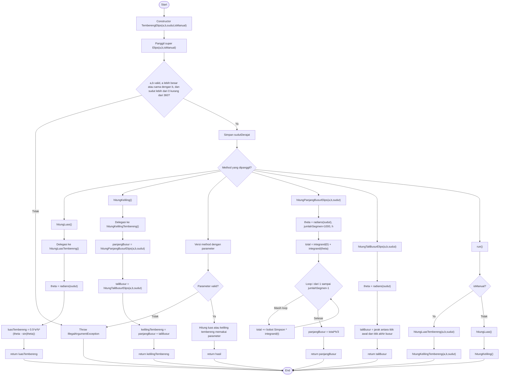
```mermaid
flowchart TD
    A([Start]) --> B["Constructor TemberengElips(a,b,sudut,isManual)"]
    B --> C["Panggil super Elips(a,b,isManual)"]
    C --> D{"a,b valid, a lebih besar atau sama dengan b, dan sudut lebih dari 0 kurang dari 360?"}
    D -- Tidak --> X["Throw IllegalArgumentException"]
    D -- Ya --> E["Simpan sudutDerajat"]

    E --> F{"Method yang dipanggil?"}
    F --> G["hitungLuas()"]
    G --> H["Delegasi ke hitungLuasTembereng()"]
    H --> H1["theta = radians(sudut)"]
    H1 --> H2["luasTembereng = 0.5*a*b*(theta - sin(theta))"]
    H2 --> H3["return luasTembereng"]

    F --> I["hitungKeliling()"]
    I --> J["Delegasi ke hitungKelilingTembereng()"]
    J --> J1["panjangBusur = hitungPanjangBusurElips(a,b,sudut)"]
    J1 --> J2["taliBusur = hitungTaliBusurElips(a,b,sudut)"]
    J2 --> J3["kelilingTembereng = panjangBusur + taliBusur"]
    J3 --> J4["return kelilingTembereng"]

    F --> K["Versi method dengan parameter"]
    K --> K1{"Parameter valid?"}
    K1 -- Tidak --> X
    K1 -- Ya --> K2["Hitung luas atau keliling tembereng memakai parameter"]
    K2 --> K3["return hasil"]

    F --> L["hitungPanjangBusurElips(a,b,sudut)"]
    L --> L1["theta = radians(sudut), jumlahSegmen=1000, h"]
    L1 --> L2["total = integrand(0) + integrand(theta)"]
    L2 --> L3{"Loop i dari 1 sampai jumlahSegmen-1"}
    L3 -- Masih loop --> L4["total += bobot Simpson * integrand(t)"]
    L4 --> L3
    L3 -- Selesai --> L5["panjangBusur = total*h/3"]
    L5 --> L6["return panjangBusur"]

    F --> M["hitungTaliBusurElips(a,b,sudut)"]
    M --> M1["theta = radians(sudut)"]
    M1 --> M2["taliBusur = jarak antara titik awal dan titik akhir busur"]
    M2 --> M3["return taliBusur"]

    F --> N["run()"]
    N --> O{"isManual?"}
    O -- Ya --> P["hitungLuasTembereng(a,b,sudut)"]
    P --> Q["hitungKelilingTembereng(a,b,sudut)"]
    O -- Tidak --> R["hitungLuas()"]
    R --> S["hitungKeliling()"]
    H3 --> T([End])
    J4 --> T
    K3 --> T
    L6 --> T
    M3 --> T
    Q --> T
    S --> T
    X --> T
```

## 9. TemberengElips3D

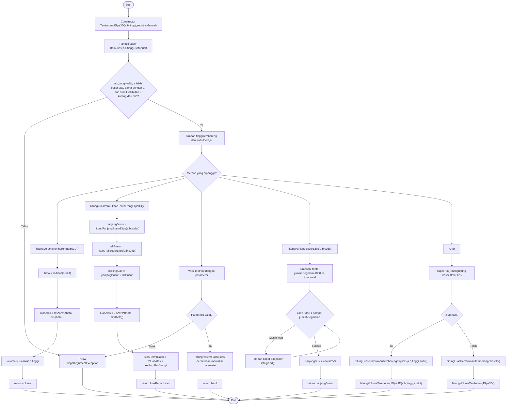
```mermaid
flowchart TD
    A([Start]) --> B["Constructor TemberengElips3D(a,b,tinggi,sudut,isManual)"]
    B --> C["Panggil super BolaElips(a,b,tinggi,isManual)"]
    C --> D{"a,b,tinggi valid, a lebih besar atau sama dengan b, dan sudut lebih dari 0 kurang dari 360?"}
    D -- Tidak --> X["Throw IllegalArgumentException"]
    D -- Ya --> E["Simpan tinggiTembereng dan sudutDerajat"]

    E --> F{"Method yang dipanggil?"}
    F --> G["hitungVolumeTemberengElips3D()"]
    G --> G1["theta = radians(sudut)"]
    G1 --> G2["luasAlas = 0.5*a*b*(theta - sin(theta))"]
    G2 --> G3["volume = luasAlas * tinggi"]
    G3 --> G4["return volume"]

    F --> H["hitungLuasPermukaanTemberengElips3D()"]
    H --> H1["panjangBusur = hitungPanjangBusurElips(a,b,sudut)"]
    H1 --> H2["taliBusur = hitungTaliBusurElips(a,b,sudut)"]
    H2 --> H3["kelilingAlas = panjangBusur + taliBusur"]
    H3 --> H4["luasAlas = 0.5*a*b*(theta - sin(theta))"]
    H4 --> H5["luasPermukaan = 2*luasAlas + kelilingAlas*tinggi"]
    H5 --> H6["return luasPermukaan"]

    F --> I["Versi method dengan parameter"]
    I --> I1{"Parameter valid?"}
    I1 -- Tidak --> X
    I1 -- Ya --> I2["Hitung volume atau luas permukaan memakai parameter"]
    I2 --> I3["return hasil"]

    F --> J["hitungPanjangBusurElips(a,b,sudut)"]
    J --> J1["Simpson: theta, jumlahSegmen=1000, h, total awal"]
    J1 --> J2{"Loop i dari 1 sampai jumlahSegmen-1"}
    J2 -- Masih loop --> J3["Tambah bobot Simpson * integrand(t)"]
    J3 --> J2
    J2 -- Selesai --> J4["panjangBusur = total*h/3"]
    J4 --> J5["return panjangBusur"]

    F --> K["run()"]
    K --> L["super.run() menghitung dasar BolaElips"]
    L --> M{"isManual?"}
    M -- Ya --> N["hitungLuasPermukaanTemberengElips3D(a,b,tinggi,sudut)"]
    N --> O["hitungVolumeTemberengElips3D(a,b,tinggi,sudut)"]
    M -- Tidak --> P["hitungLuasPermukaanTemberengElips3D()"]
    P --> Q["hitungVolumeTemberengElips3D()"]
    G4 --> R([End])
    H6 --> R
    I3 --> R
    J5 --> R
    O --> R
    Q --> R
    X --> R
```

## 10. LimasElips

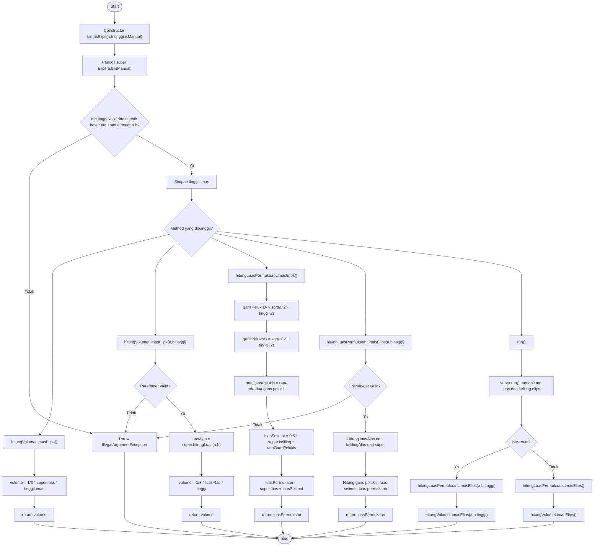
```mermaid
flowchart TD
    A([Start]) --> B["Constructor LimasElips(a,b,tinggi,isManual)"]
    B --> C["Panggil super Elips(a,b,isManual)"]
    C --> D{"a,b,tinggi valid dan a lebih besar atau sama dengan b?"}
    D -- Tidak --> X["Throw IllegalArgumentException"]
    D -- Ya --> E["Simpan tinggiLimas"]

    E --> F{"Method yang dipanggil?"}
    F --> G["hitungVolumeLimasElips()"]
    G --> G1["volume = 1/3 * super.luas * tinggiLimas"]
    G1 --> G2["return volume"]

    F --> H["hitungVolumeLimasElips(a,b,tinggi)"]
    H --> H1{"Parameter valid?"}
    H1 -- Tidak --> X
    H1 -- Ya --> H2["luasAlas = super.hitungLuas(a,b)"]
    H2 --> H3["volume = 1/3 * luasAlas * tinggi"]
    H3 --> H4["return volume"]

    F --> I["hitungLuasPermukaanLimasElips()"]
    I --> I1["garisPelukisA = sqrt(a^2 + tinggi^2)"]
    I1 --> I2["garisPelukisB = sqrt(b^2 + tinggi^2)"]
    I2 --> I3["rataGarisPelukis = rata-rata dua garis pelukis"]
    I3 --> I4["luasSelimut = 0.5 * super.keliling * rataGarisPelukis"]
    I4 --> I5["luasPermukaan = super.luas + luasSelimut"]
    I5 --> I6["return luasPermukaan"]

    F --> J["hitungLuasPermukaanLimasElips(a,b,tinggi)"]
    J --> J1{"Parameter valid?"}
    J1 -- Tidak --> X
    J1 -- Ya --> J2["Hitung luasAlas dan kelilingAlas dari super"]
    J2 --> J3["Hitung garis pelukis, luas selimut, luas permukaan"]
    J3 --> J4["return luasPermukaan"]

    F --> K["run()"]
    K --> L["super.run() menghitung luas dan keliling elips"]
    L --> M{"isManual?"}
    M -- Ya --> N["hitungLuasPermukaanLimasElips(a,b,tinggi)"]
    N --> O["hitungVolumeLimasElips(a,b,tinggi)"]
    M -- Tidak --> P["hitungLuasPermukaanLimasElips()"]
    P --> Q["hitungVolumeLimasElips()"]
    G2 --> R([End])
    H4 --> R
    I6 --> R
    J4 --> R
    O --> R
    Q --> R
    X --> R
```

## 11. LimasElipsTerpancung

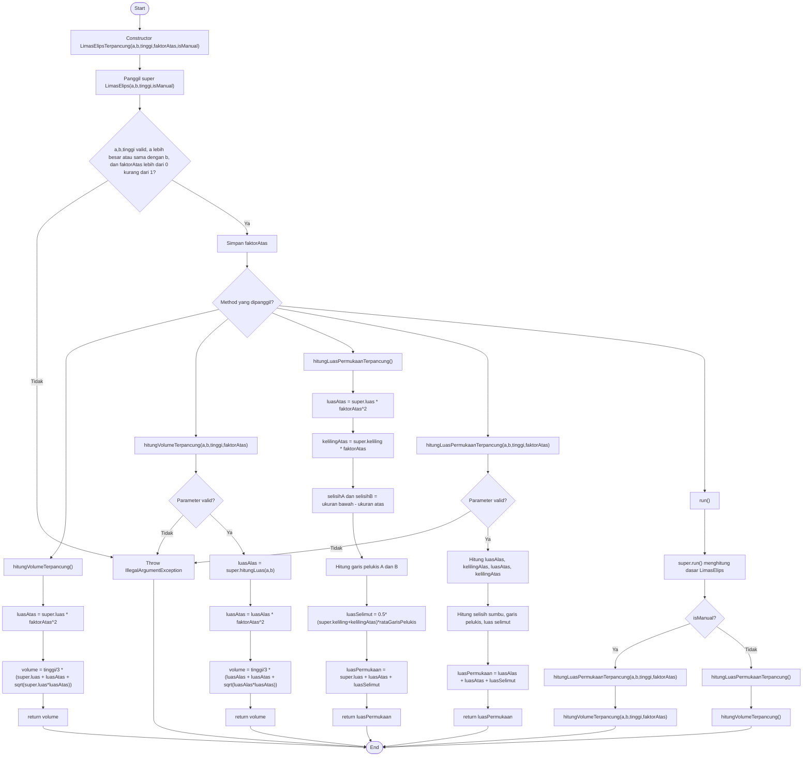
```mermaid
flowchart TD
    A([Start]) --> B["Constructor LimasElipsTerpancung(a,b,tinggi,faktorAtas,isManual)"]
    B --> C["Panggil super LimasElips(a,b,tinggi,isManual)"]
    C --> D{"a,b,tinggi valid, a lebih besar atau sama dengan b, dan faktorAtas lebih dari 0 kurang dari 1?"}
    D -- Tidak --> X["Throw IllegalArgumentException"]
    D -- Ya --> E["Simpan faktorAtas"]

    E --> F{"Method yang dipanggil?"}
    F --> G["hitungVolumeTerpancung()"]
    G --> G1["luasAtas = super.luas * faktorAtas^2"]
    G1 --> G2["volume = tinggi/3 * (super.luas + luasAtas + sqrt(super.luas*luasAtas))"]
    G2 --> G3["return volume"]

    F --> H["hitungVolumeTerpancung(a,b,tinggi,faktorAtas)"]
    H --> H1{"Parameter valid?"}
    H1 -- Tidak --> X
    H1 -- Ya --> H2["luasAlas = super.hitungLuas(a,b)"]
    H2 --> H3["luasAtas = luasAlas * faktorAtas^2"]
    H3 --> H4["volume = tinggi/3 * (luasAlas + luasAtas + sqrt(luasAlas*luasAtas))"]
    H4 --> H5["return volume"]

    F --> I["hitungLuasPermukaanTerpancung()"]
    I --> I1["luasAtas = super.luas * faktorAtas^2"]
    I1 --> I2["kelilingAtas = super.keliling * faktorAtas"]
    I2 --> I3["selisihA dan selisihB = ukuran bawah - ukuran atas"]
    I3 --> I4["Hitung garis pelukis A dan B"]
    I4 --> I5["luasSelimut = 0.5*(super.keliling+kelilingAtas)*rataGarisPelukis"]
    I5 --> I6["luasPermukaan = super.luas + luasAtas + luasSelimut"]
    I6 --> I7["return luasPermukaan"]

    F --> J["hitungLuasPermukaanTerpancung(a,b,tinggi,faktorAtas)"]
    J --> J1{"Parameter valid?"}
    J1 -- Tidak --> X
    J1 -- Ya --> J2["Hitung luasAlas, kelilingAlas, luasAtas, kelilingAtas"]
    J2 --> J3["Hitung selisih sumbu, garis pelukis, luas selimut"]
    J3 --> J4["luasPermukaan = luasAlas + luasAtas + luasSelimut"]
    J4 --> J5["return luasPermukaan"]

    F --> K["run()"]
    K --> L["super.run() menghitung dasar LimasElips"]
    L --> M{"isManual?"}
    M -- Ya --> N["hitungLuasPermukaanTerpancung(a,b,tinggi,faktorAtas)"]
    N --> O["hitungVolumeTerpancung(a,b,tinggi,faktorAtas)"]
    M -- Tidak --> P["hitungLuasPermukaanTerpancung()"]
    P --> Q["hitungVolumeTerpancung()"]
    G3 --> R([End])
    H5 --> R
    I7 --> R
    J5 --> R
    O --> R
    Q --> R
    X --> R
```

## 12. PrismaElips

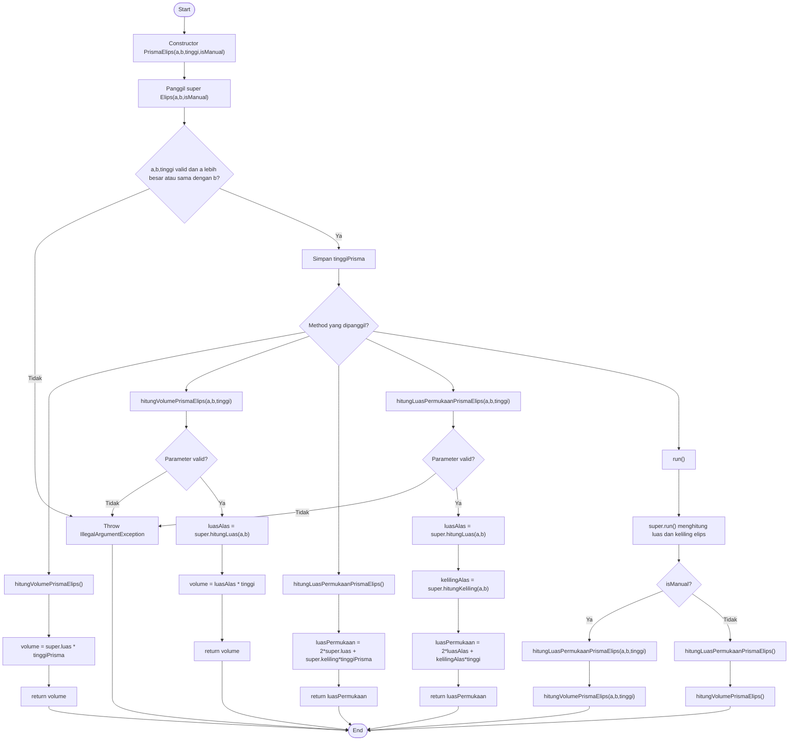
```mermaid
flowchart TD
    A([Start]) --> B["Constructor PrismaElips(a,b,tinggi,isManual)"]
    B --> C["Panggil super Elips(a,b,isManual)"]
    C --> D{"a,b,tinggi valid dan a lebih besar atau sama dengan b?"}
    D -- Tidak --> X["Throw IllegalArgumentException"]
    D -- Ya --> E["Simpan tinggiPrisma"]

    E --> F{"Method yang dipanggil?"}
    F --> G["hitungVolumePrismaElips()"]
    G --> G1["volume = super.luas * tinggiPrisma"]
    G1 --> G2["return volume"]

    F --> H["hitungVolumePrismaElips(a,b,tinggi)"]
    H --> H1{"Parameter valid?"}
    H1 -- Tidak --> X
    H1 -- Ya --> H2["luasAlas = super.hitungLuas(a,b)"]
    H2 --> H3["volume = luasAlas * tinggi"]
    H3 --> H4["return volume"]

    F --> I["hitungLuasPermukaanPrismaElips()"]
    I --> I1["luasPermukaan = 2*super.luas + super.keliling*tinggiPrisma"]
    I1 --> I2["return luasPermukaan"]

    F --> J["hitungLuasPermukaanPrismaElips(a,b,tinggi)"]
    J --> J1{"Parameter valid?"}
    J1 -- Tidak --> X
    J1 -- Ya --> J2["luasAlas = super.hitungLuas(a,b)"]
    J2 --> J3["kelilingAlas = super.hitungKeliling(a,b)"]
    J3 --> J4["luasPermukaan = 2*luasAlas + kelilingAlas*tinggi"]
    J4 --> J5["return luasPermukaan"]

    F --> K["run()"]
    K --> L["super.run() menghitung luas dan keliling elips"]
    L --> M{"isManual?"}
    M -- Ya --> N["hitungLuasPermukaanPrismaElips(a,b,tinggi)"]
    N --> O["hitungVolumePrismaElips(a,b,tinggi)"]
    M -- Tidak --> P["hitungLuasPermukaanPrismaElips()"]
    P --> Q["hitungVolumePrismaElips()"]
    G2 --> R([End])
    H4 --> R
    I2 --> R
    J5 --> R
    O --> R
    Q --> R
    X --> R
```

## 13. GeometriGUI

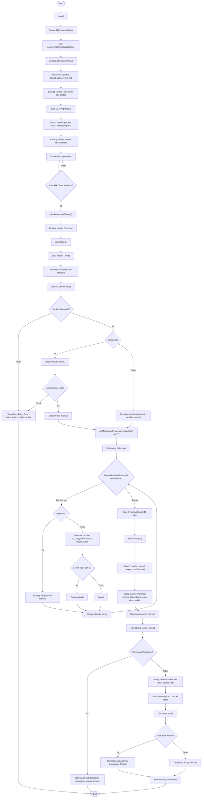
```mermaid
flowchart TD
    A([Start]) --> B["main()"]
    B --> C["SwingUtilities.invokeLater"]
    C --> D["new GeometriGUI().setVisible(true)"]
    D --> E["Constructor GeometriGUI"]
    E --> F["Inisialisasi JButton, JComboBox, JTextField"]
    F --> G["Buat 11 DefaultTableModel dan JTable"]
    G --> H["Buat 11 JProgressBar"]
    H --> I["Susun panel input, tab hasil, panel progress"]
    I --> J["Pasang ActionListener btnGenerate"]
    J --> K["Frame siap digunakan"]

    K --> L{"User klik Generate Data?"}
    L -- Tidak --> K
    L -- Ya --> M["jalankanMasterThread()"]
    M --> N["Disable tombol Generate"]
    N --> O["resetTabel()"]
    O --> P["Buat masterThread"]
    P --> Q["Tentukan isManual dari cbMode"]
    Q --> R["validasiJumlahData()"]
    R --> S{"Jumlah data valid?"}
    S -- Tidak --> X["Tampilkan dialog Error Validasi dan enable tombol"]
    S -- Ya --> T{"isManual?"}
    T -- Ya --> U["validasiInputManual()"]
    U --> V{"Input manual valid?"}
    V -- Tidak --> X
    V -- Ya --> W["Simpan nilai manual"]
    T -- Tidak --> Y["Gunakan nilai default untuk variabel manual"]
    W --> Z["setMaksimumProgress(jumlahData) di EDT"]
    Y --> Z

    Z --> AA["Buat array data input"]
    AA --> AB{"Loop data i dari 0 sampai jumlahData-1"}
    AB -- Masih loop --> AC{"isManual?"}
    AC -- Ya --> AD["Isi array dengan nilai manual"]
    AC -- Tidak --> AE["Generate random a,b,tinggi,sudut,input dalam,faktor"]
    AE --> AF{"a lebih kecil dari b?"}
    AF -- Ya --> AG["Tukar a dan b"]
    AF -- Tidak --> AH["Lanjut"]
    AD --> AI["Simpan data ke array"]
    AG --> AI
    AH --> AI
    AI --> AB
    AB -- Selesai --> AJ["Buat array hasil untuk 11 tabel"]

    AJ --> AK["Buat errors[11]"]
    AK --> AL["Buat 11 worker thread dengan buatThread()"]
    AL --> AM["Setiap worker memakai lambda HitungBaris untuk class terkait"]
    AM --> AN["Start semua worker thread"]
    AN --> AO["Join semua worker thread"]
    AO --> AP{"InterruptedException?"}
    AP -- Ya --> AQ["Interrupt thread, tampilkan peringatan, enable tombol"]
    AP -- Tidak --> AR["SwingUtilities.invokeLater untuk update hasil"]

    AR --> AS["tambahBaris() ke 11 model tabel"]
    AS --> AT["Cek array errors"]
    AT --> AU{"Ada error thread?"}
    AU -- Ya --> AV["Tampilkan dialog Error Komputasi Thread"]
    AU -- Tidak --> AW["Tampilkan dialog Sukses"]
    AV --> AX["Enable tombol Generate"]
    AW --> AX
    AX --> AY([End])
    X --> AY
    AQ --> AY
```

### Detail Worker Thread pada GeometriGUI

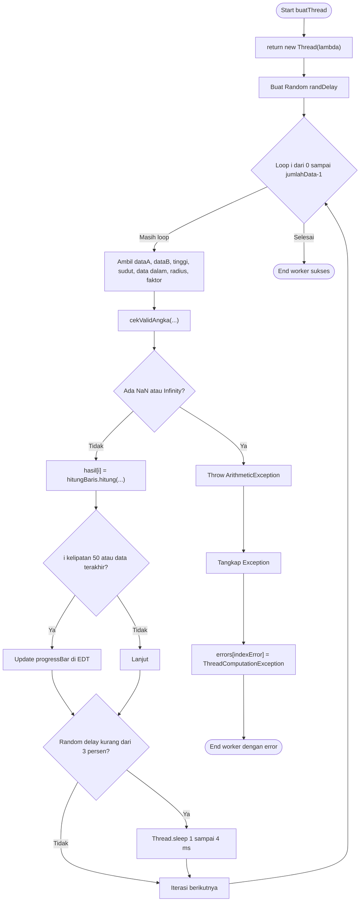
```mermaid
flowchart TD
    A([Start buatThread]) --> B["return new Thread(lambda)"]
    B --> C["Buat Random randDelay"]
    C --> D{"Loop i dari 0 sampai jumlahData-1"}
    D -- Masih loop --> E["Ambil dataA, dataB, tinggi, sudut, data dalam, radius, faktor"]
    E --> F["cekValidAngka(...)"]
    F --> G{"Ada NaN atau Infinity?"}
    G -- Ya --> X["Throw ArithmeticException"]
    G -- Tidak --> H["hasil[i] = hitungBaris.hitung(...)"]
    H --> I{"i kelipatan 50 atau data terakhir?"}
    I -- Ya --> J["Update progressBar di EDT"]
    I -- Tidak --> K["Lanjut"]
    J --> L{"Random delay kurang dari 3 persen?"}
    K --> L
    L -- Ya --> M["Thread.sleep 1 sampai 4 ms"]
    L -- Tidak --> N["Iterasi berikutnya"]
    M --> N
    N --> D
    D -- Selesai --> O([End worker sukses])
    X --> P["Tangkap Exception"]
    P --> Q["errors[indexError] = ThreadComputationException"]
    Q --> R([End worker dengan error])
```

### Detail Validasi GeometriGUI

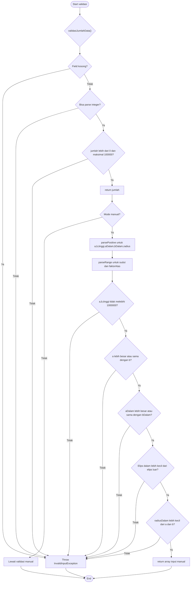
```mermaid
flowchart TD
    A([Start validasi]) --> B{"validasiJumlahData()"}
    B --> C{"Field kosong?"}
    C -- Ya --> X["Throw InvalidInputException"]
    C -- Tidak --> D{"Bisa parse integer?"}
    D -- Tidak --> X
    D -- Ya --> E{"jumlah lebih dari 0 dan maksimal 100000?"}
    E -- Tidak --> X
    E -- Ya --> F["return jumlah"]

    F --> G{"Mode manual?"}
    G -- Tidak --> H["Lewati validasi manual"]
    G -- Ya --> I["parsePositive untuk a,b,tinggi,aDalam,bDalam,radius"]
    I --> J["parseRange untuk sudut dan faktorAtas"]
    J --> K{"a,b,tinggi tidak melebihi 1000000?"}
    K -- Tidak --> X
    K -- Ya --> L{"a lebih besar atau sama dengan b?"}
    L -- Tidak --> X
    L -- Ya --> M{"aDalam lebih besar atau sama dengan bDalam?"}
    M -- Tidak --> X
    M -- Ya --> N{"Elips dalam lebih kecil dari elips luar?"}
    N -- Tidak --> X
    N -- Ya --> O{"radiusDalam lebih kecil dari a dan b?"}
    O -- Tidak --> X
    O -- Ya --> P["return array input manual"]
    H --> Q([End])
    P --> Q
    X --> Q
```
